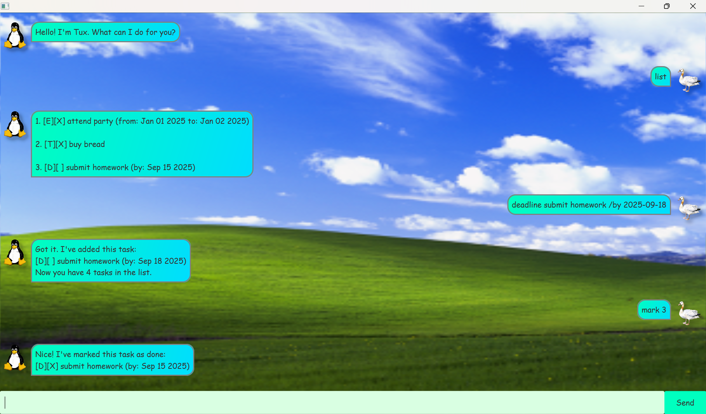

# Tux User Guide




## Introduction
Tux is a simple Java application that helps you keep track of your tasks. 

Tux supports three task types:
* Todo
* Deadline
* Event

> [!IMPORTANT]
>* For `date` arguments, only the ddd-MM-yyyy (eg. `01-01-2025`) format is supported.


## Add todos

You can add a todo task by typing the command:

Example: `todo <description>`

Expected outcome:

```
Got it. I've added this task:
[T][ ] buy bread
Now you have 3 tasks in the list.
```


## Adding deadlines

You can add a deadline task by typing the command:

Example: `deadline <description> /by <date>`

Expected outcome:

```
Got it. I've added this task:
[D][ ] do homework (by: Jan 2 2025)
Now you have 3 tasks in the list.
```


## Adding events

You can add a deadline task by typing the command:

Example: `event <description> /from <date> /to <date>`

Expected outcome:

```
Got it. I've added this task:
[E][ ] hackathon from: Jan 01 2025 to: Jan 03 2025
Now you have 3 tasks in the list.
```

## Marking and unmarking tasks

You can mark, or complete, and unmark a task:

Example: `mark <index>`

Expected outcome:

```
Nice! I've marked this task as done:
[T][X] buy bread
```

## Delete tasks

You can delete a task:

Example: `delete <index>`


Expected outcome:
```
Noted, I've removed this task:
[T][X] buy bread
Now you have 3 tasks in the list.
```

## Find tasks

You can search for tasks containing a keyword (not case-sensitive) in their description.

Example: `find <keyword>`

Expected outcome:
```
Here are the matching tasks in your list:
[E][X] attend party from: Jan 01 2025 to: Jan 02 2025
[T][ ] buy farewell party materials
```

# Get reminders for upcoming tasks

You can get a reminder for all tasks due within the next 7 days.

Example: `remind`

Expected outcome:
```
Here are the upcoming events:
[E][ ] attend party from: Jan 01 2025 to: Jan 02 2025

Here are the upcoming deadlines:
[D][ ] submit homework (by: Sep 15 2025)

```

## List your tasks

You can get a complete list of your tasks:

Example: `list`

Expected outcome:
```
1. [E][ ] attend party from: Jan 01 2025 to: Jan 02 2025
2. [T][X] buy bread
3. [D][ ] submit homework (by: Sep 15 2025)
```

## Exit program

Example: `bye`